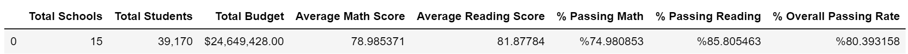

# Academy of Py

### District Summary
After computing the summary of the data given, it seems that there is a total of 15 schools in the district, with a total of 39,170 students which have an average overall passing rate of about 80[%]. Summary also shows that the average math score is slightly lower than the reading score, and the passing math rate is much smaller than the passing reading rate.

### Top Performing Schools (By Passing Rate)
A further insight into the data shows that the top 5 performing schools have an overall passing rate 15% above the district average, and similar scores and passing rate between reading and math

_table.PNG)

### Bottom Performing Schools (By Passing Rate)
The bottom 5 performing schools have an overall passing rate 12% less than the district average, which means that the distribution of the total schools' overall passing rate might be skewed towards the high performing schools. Moreover, it seems to be an imbalance between the passing rate and scores between math and reading.

_table.PNG)

### Math Scores by Grade**
After grouping the average math scores by grade and school, it seems that there is no major difference between grades among the same school, but there is a difference between schools.

 

### Reading Scores by Grade
Similar to the math grouping, we can draw the same conclusion.

### Scores by School Spending
When considering the spending ranges per student, it seems that there is no improvement in the passing rate with the increase in spending, but the the contrary.

### Scores by School Size
By taking the school size into account, the passing rate is much worse on large schools compared to medium and small.

### Scores by School Type

Finally, the grouping by school type shows that the charter schools have passing rate much higher than the district schools, and that this seems to be due to the low math passing rate of the district schools.

### Conclusion

The data shows that the spending per student has nothing to do with the performance of the school, but the large schools which are probably also district schools are lowering the overall passing rates. Moreover,.there is a big imbalance between math and reading scores for the district schools.
